# SmartExpApp

SmartExpApp là ứng dụng Android hoạt động theo cơ chế **ưu tiên lưu trữ nội bộ (local-first)** giúp quản lý thời hạn sử dụng thực phẩm, theo dõi kho hàng gia đình, cảnh báo hết hạn và đề xuất món ăn thông minh bằng AI. Ứng dụng tích hợp cơ sở dữ liệu Room ngoại tuyến, Google ML Kit OCR trích xuất ngày hết hạn tự động và Cloudflare Workers AI hỗ trợ các tính năng thông minh.

---

## Tính năng nổi bật

- **Local-First (Phần lớn tính năng chạy offline):** Cơ sở dữ liệu SQLite cục bộ (Room DB) giúp chạy mượt mà, phản hồi nhanh và bảo mật dữ liệu mà không cần internet.
- **Nhận diện hạn dùng qua Camera (OCR):** Tự động nhận diện và trích xuất ngày hết hạn trên bao bì sản phẩm bằng Google ML Kit.
- **Thêm sản phẩm thông minh (Smart Add):** Nhập/ghi âm mô tả sản phẩm bằng ngôn ngữ tự nhiên để AI tự động phân tích và thêm vào kho.
- **Gợi ý món ăn AI:** Tự động đề xuất công thức nấu ăn dựa trên nguyên liệu sắp hết hạn có sẵn.
- **Trợ lý ảo thông minh:** Chatbot hỗ trợ tư vấn bảo quản thực phẩm và thay thế nguyên liệu.
- **Đồng bộ hóa đám mây (Tùy chọn):** Sao lưu và đồng bộ hóa dữ liệu trực tuyến qua Firebase Firestore.
- **Giao diện sáng/tối đồng bộ:** Thiết kế hiện đại thích ứng hoàn toàn theo cài đặt hệ thống.

---

## Giao diện ứng dụng (Screenshots)

| Màn hình | Chế độ Sáng | Chế độ Tối |
| :--- | :---: | :---: |
| **Bảng điều khiển (Dashboard)** | 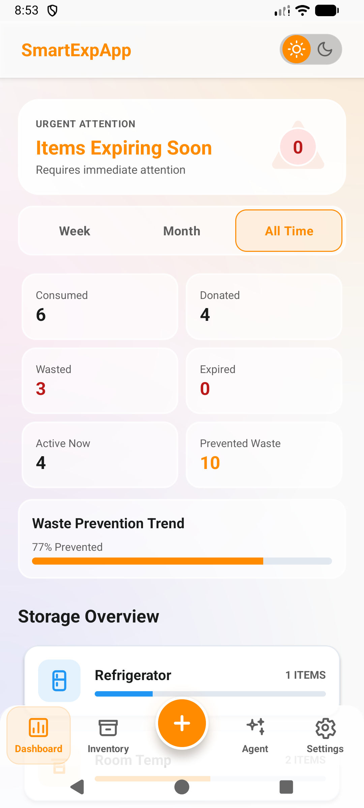 | 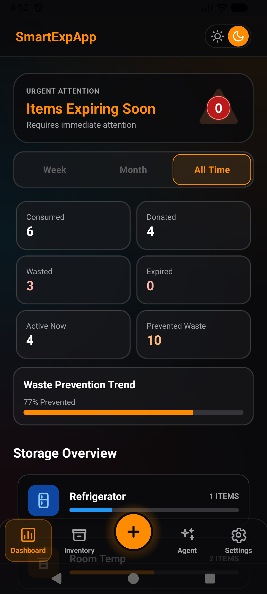 |
| **Danh mục kho hàng (Inventory)** | 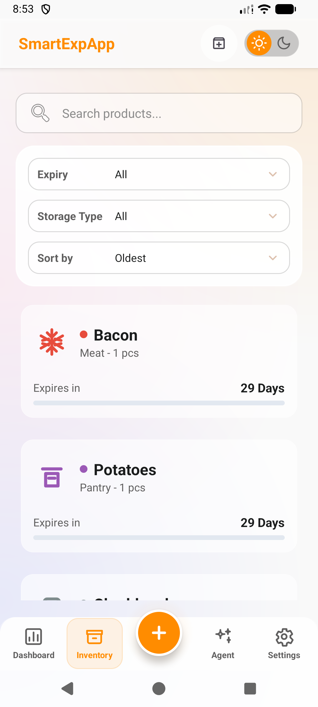 | 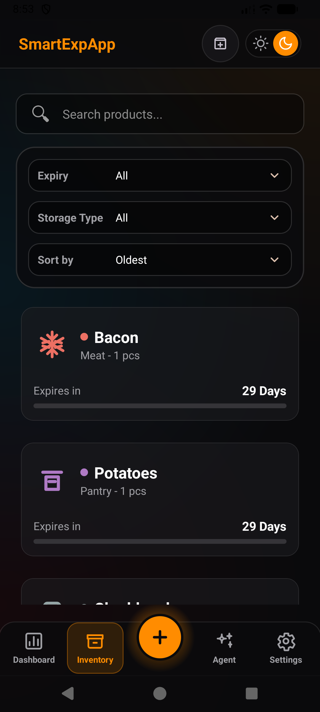 |
| **Thêm nhanh sản phẩm (Smart Add)** | 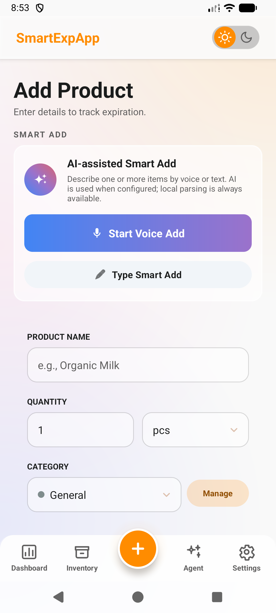 | 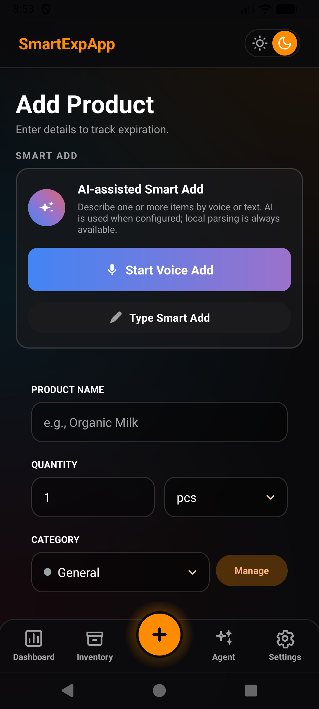 |
| **Nhật ký & Lịch sử (History)** | 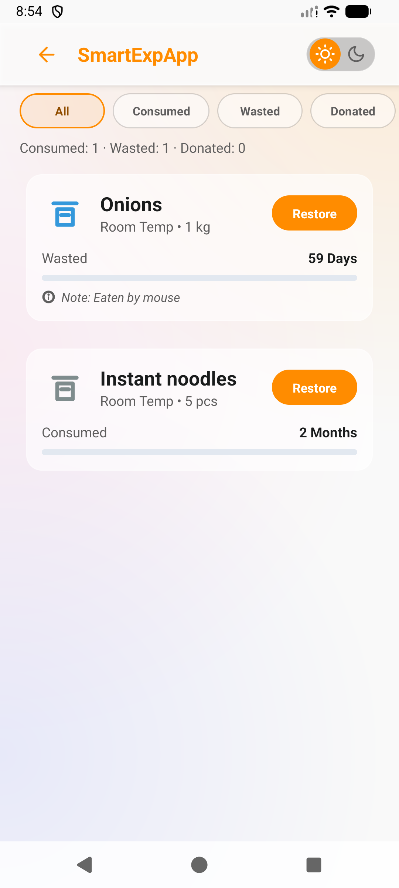 | 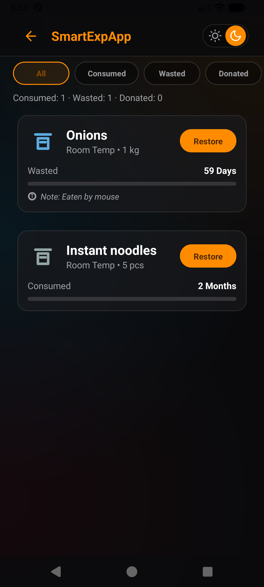 |
| **Gợi ý món ăn (Recipes)** | 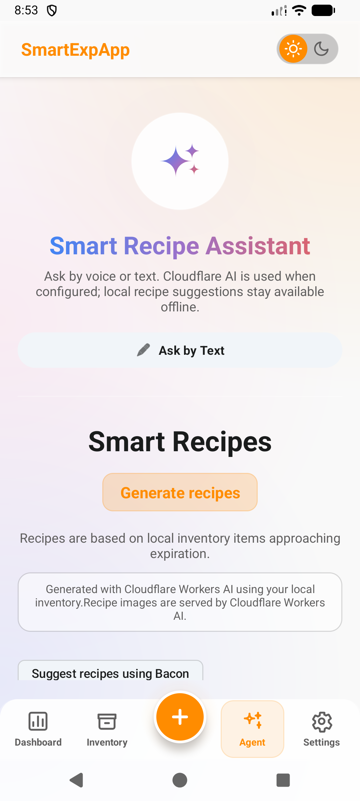 | 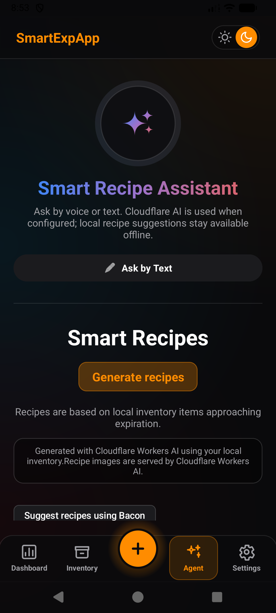 |
| **Cài đặt hệ thống (Settings)** | 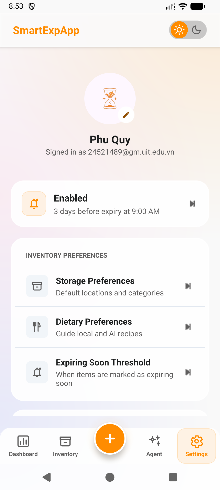 | 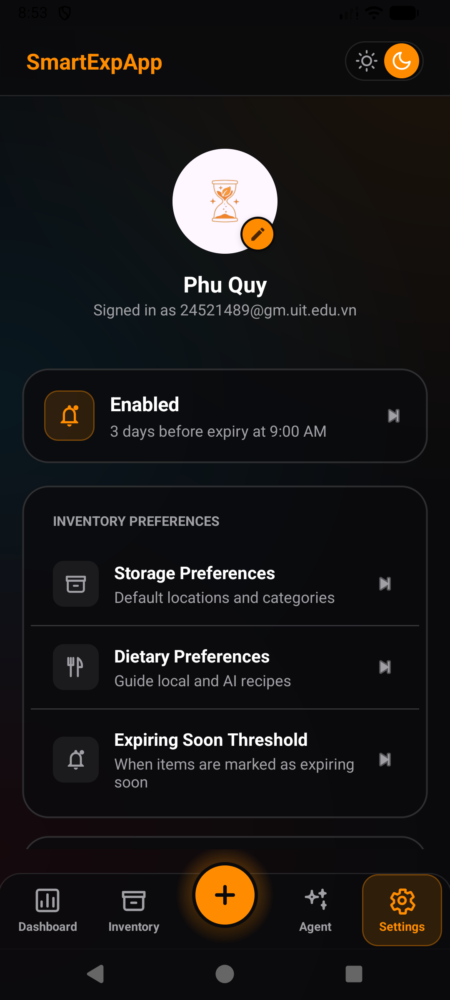 |

---

## Hướng dẫn cài đặt & Chạy ứng dụng

Bạn có thể chạy thử ứng dụng bằng một trong hai cách dưới đây:

### Cách 1: Cài đặt trực tiếp qua file Release APK (Nhanh nhất)
1. Tải xuống tệp tin APK đã được đóng gói sẵn:
   - **Tải từ GitHub Release:** [](https://github.com/thqhuong/SmartExpApp/releases/download/v1.0/app-release.apk)
   - **Hoặc lấy trực tiếp từ mã nguồn:** [app-release.apk](app/build/outputs/apk/release/app-release.apk)
2. Sao chép tệp APK vào thiết bị Android của bạn (yêu cầu Android 8.0 trở lên).
3. Mở tệp APK trên thiết bị và tiến hành cài đặt (đồng ý cài đặt từ nguồn không xác định nếu thiết bị yêu cầu).

### Cách 2: Chạy từ mã nguồn bằng Android Studio (Dành cho Lập trình viên)
1. **Yêu cầu hệ thống:** Cài đặt Java Development Kit (JDK 17) và Android Studio (Ladybug trở lên).
2. **Clone & Mở dự án:**
   ```bash
   git clone https://github.com/thqhuong/SmartExpApp.git
   ```
   Mở thư mục `SmartExpApp` trong Android Studio và đợi quá trình đồng bộ Gradle hoàn tất.
3. **Cấu hình AI (Tùy chọn):** Để kích hoạt đầy đủ các tính năng AI, tạo/chỉnh sửa tệp `local.properties` tại thư mục gốc và thêm các endpoints:
   ```properties
   AI_WORKER_URL=https://your-worker.example.workers.dev
   RECIPE_IMAGE_WORKER_URL=https://your-worker.example.workers.dev
   PRODUCT_PARSER_WORKER_URL=https://your-worker.example.workers.dev
   ```
   *Lưu ý: Ứng dụng vẫn chạy tốt ngoại tuyến ở chế độ dự phòng (fallback) nếu bỏ qua bước cấu hình AI.*
4. **Chạy ứng dụng:**
   - Kết nối thiết bị Android thật (đã bật USB Debugging) hoặc khởi động máy ảo Android Emulator.
   - Nhấn nút **Run** (biểu tượng Play màu xanh lá) trong Android Studio, hoặc chạy lệnh sau trong Terminal để cài đặt trực tiếp:
     ```bash
     ./gradlew installDebug
     ```
