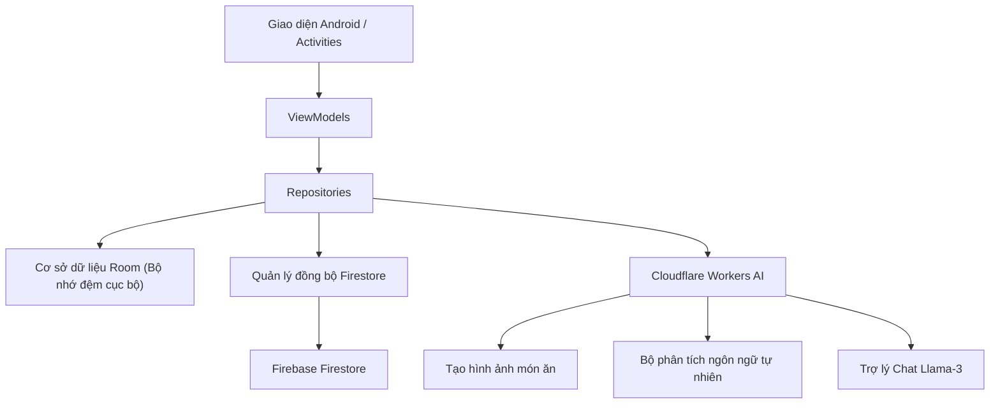

# SmartExpApp

SmartExpApp là một ứng dụng Android hiện đại hoạt động theo cơ chế **ưu tiên lưu trữ nội bộ (local-first)**, được thiết kế nhằm giúp người dùng quản lý thời hạn sử dụng của thực phẩm, kiểm soát kho hàng gia đình, thiết lập nhắc nhở tự động và giảm thiểu tối đa tình trạng lãng phí thực phẩm. 

Bằng việc kết hợp cơ sở dữ liệu [AppDatabase](file:///c:/Users/ADMIN/AndroidStudioProjects/SmartExpApp/app/src/main/java/com/example/smartexpapp/data/local/AppDatabase.java) ([Room Database]) hoạt động ngoại tuyến mượt mà, thư viện nhận dạng ký tự quang học **Google ML Kit OCR** trích xuất ngày hết hạn tiện lợi, và các dịch vụ trí tuệ nhân tạo tùy chọn từ **Cloudflare Workers AI** (gợi ý món ăn và phân tích cú pháp sản phẩm), SmartExpApp mang tới trải nghiệm tiện lợi, hiệu quả và tối giản cho cuộc sống thông minh của bạn.

---

## Tải APK cài đặt nhanh

Tải xuống bản dựng đã được đóng gói của SmartExpApp để chạy thử trên thiết bị di động của bạn:

[](https://github.com/thqhuong/SmartExpApp/releases/download/v1.0/app-release.apk)

*   **Đường dẫn tệp tin trong kho lưu trữ:** [app-release.apk](file:///c:/Users/ADMIN/AndroidStudioProjects/SmartExpApp/app/build/outputs/apk/release/app-release.apk)
*   **Dung lượng tệp:** ~68 MB
*   **Yêu cầu hệ thống:** Android 8.0 (API level 28) trở lên.

> [!NOTE]
> Nếu tự biên dịch dự án từ mã nguồn, tệp tin APK được tạo ra sẽ nằm tại đường dẫn trên. Nếu chưa cấu hình thông tin chữ ký (signing credentials), Gradle sẽ biên dịch tệp dưới tên `app-release-unsigned.apk` thay thế.

---

## Cấu trúc các nhánh trong Repository

Để giữ cho nhánh chính (`master`) gọn gàng và tập trung hoàn toàn vào mã nguồn ứng dụng Android Native, các thành phần phụ trợ đã được tách và lưu trữ tại các nhánh Git riêng biệt:
- **Nhánh `web-prototype`:** Chứa mã nguồn của bản mô phỏng giao diện web (`googleaistudio/`).
- **Nhánh `cloudflare-worker`:** Chứa mã nguồn của Cloudflare Workers AI phục vụ tạo ảnh món ăn (`cloudflare-recipe-images/`).

---

## Các tính năng cốt lõi

-   **Lưu trữ ưu tiên nội bộ (Local-First):** Cơ sở dữ liệu SQLite ngoại tuyến thông qua [AppDatabase](file:///c:/Users/ADMIN/AndroidStudioProjects/SmartExpApp/app/src/main/java/com/example/smartexpapp/data/local/AppDatabase.java) giúp ứng dụng hoạt động tức thì, phản hồi nhanh và bảo vệ quyền riêng tư người dùng.
-   **Nhập sản phẩm thông minh (Smart Add):** Cho phép nhập thực phẩm hàng loạt bằng giọng nói hoặc văn bản qua ngôn ngữ mô tả tự nhiên thông thường.
-   **Quét ngày hết hạn qua camera (OCR):** Nhận diện chữ viết trên nhãn chai lọ, bao bì thực phẩm để trích xuất và điền ngày hết hạn tự động thông qua Google ML Kit.
-   **Gợi ý công thức món ăn AI:** Đề xuất các món ăn kèm hướng dẫn chuẩn bị từ các nguyên liệu sắp hết hạn đang có sẵn trong kho hàng.
-   **Trợ lý ảo hỗ trợ:** Tích hợp tính năng Chatbot tư vấn, trả lời nhanh các thắc mắc về bảo quản thực phẩm hoặc thay thế gia vị khi nấu ăn.
-   **Đồng bộ hóa đám mây tùy chọn:** Khả năng đồng bộ trực tuyến thông qua Firebase Auth và Cloud Firestore giúp sao lưu dữ liệu trên nhiều thiết bị.
-   **Giao diện sáng/tối đồng bộ:** Thiết kế giao diện hiện đại hỗ trợ đầy đủ các hiệu ứng tối giản thích ứng theo cài đặt hệ thống.

---

## Trực quan hóa Giao diện

### Các màn hình chính (Chế độ Sáng / Tối)

| Tính năng / Màn hình | Chế độ Sáng | Chế độ Tối |
| :--- | :---: | :---: |
| **Bảng điều khiển (Dashboard)** <br> Thống kê nhanh tình trạng kho, biểu đồ lượng tiêu thụ, thực phẩm lãng phí và phân chia theo danh mục. |  |  |
| **Danh mục kho hàng (Inventory)** <br> Hiển thị danh sách thực phẩm, lọc theo tình trạng hạn sử dụng (đã hết hạn, sắp hết hạn, an toàn) và tìm kiếm/sắp xếp nhanh. |  |  |
| **Thêm nhanh sản phẩm (Smart Add)** <br> Nhập văn bản hoặc ghi âm giọng nói ngôn ngữ tự nhiên để hệ thống phân tích và điền thông số tự động. |  |  |
| **Nhật ký & Lịch sử (History)** <br> Ghi lại biểu đồ thống kê thói quen sử dụng thực phẩm hàng tuần, hàng tháng giúp cải thiện kế hoạch mua sắm. |  |  |
| **Gợi ý món ăn (Recipes)** <br> Các thẻ công thức đề xuất nguyên liệu chi tiết và quy trình thực hiện đi kèm hình ảnh bắt mắt. |  |  |
| **Cài đặt hệ thống (Settings)** <br> Thiết lập ngưỡng cảnh báo (nhắc trước bao nhiêu ngày), kiểm tra kết nối AI và quản lý sao lưu/đồng bộ cơ sở dữ liệu. |  |  |

---

## Kiến trúc & Công nghệ sử dụng



-   **Frontend:** Giao diện Native Android (sử dụng ngôn ngữ Java trên Android SDK API 36)
-   **Database:** [AppDatabase](file:///c:/Users/ADMIN/AndroidStudioProjects/SmartExpApp/app/src/main/java/com/example/smartexpapp/data/local/AppDatabase.java) (SQLite cục bộ qua Room DB), Firebase Firestore (Đồng bộ đám mây tùy chọn)
-   **Xác thực:** Firebase Auth & Android Credential Manager (Đăng nhập Một chạm One-Tap)
-   **AI Endpoints:** Kết nối thông qua máy chủ phụ trợ Cloudflare Workers AI
-   **OCR Engine:** Công nghệ nhận dạng văn bản trên thiết bị Google ML Kit

---

## Hướng dẫn cài đặt dự án

### Yêu cầu cấu hình xây dựng
- Công cụ Android Studio (Khuyên dùng phiên bản Ladybug trở lên)
- Java Development Kit (JDK) phiên bản 17
- Thiết bị thử nghiệm (Máy ảo Emulator hoặc điện thoại chạy hệ điều hành Android 8.0 trở lên)

### Các bước cấu hình môi trường
1. Clone dự án và mở thư mục gốc của dự án trong phần mềm Android Studio.
2. Tệp tin [google-services.json](file:///c:/Users/ADMIN/AndroidStudioProjects/SmartExpApp/app/google-services.json) cấu hình Firebase là tùy chọn cho hoạt động thử nghiệm cục bộ (nếu thiếu, tập lệnh biên dịch sẽ tự động tạo tệp tạm để quá trình build không bị lỗi).
3. Thiết lập kết nối AI bằng cách điền các giá trị endpoint của bạn vào tệp [local.properties](file:///c:/Users/ADMIN/AndroidStudioProjects/SmartExpApp/local.properties) (hoặc thông qua cấu hình các biến môi trường):

```properties
AI_WORKER_URL=https://your-worker.example.workers.dev
RECIPE_IMAGE_WORKER_URL=https://your-worker.example.workers.dev
PRODUCT_PARSER_WORKER_URL=https://your-worker.example.workers.dev
```

*Lưu ý: SmartExpApp hỗ trợ chế độ hoạt động ngoại tuyến tự động ngoại biên (local fallback) khi để trống các đường dẫn URL trên.*

---

## Kiểm thử & Xác minh phần mềm

Để khởi chạy các bài kiểm thử đơn vị hoặc kiểm thử tích hợp trên dòng lệnh, sử dụng PowerShell tại thư mục gốc:

```powershell
# Chạy các bài kiểm thử cục bộ cho Room DB và Repositories
.\gradlew.bat test

# Biên dịch bản gỡ lỗi (Debug APK)
.\gradlew.bat :app:assembleDebug

# Khởi chạy phân tích mã nguồn tĩnh (Lint)
.\gradlew.bat :app:lintDebug

# Kiểm thử quy tắc bảo mật dữ liệu của Firestore
npm run test:firestore-rules
```

Nếu đang kết nối thiết bị thật hoặc máy ảo Android:
```powershell
# Thực hiện kiểm thử UI tự động trên thiết bị (Android Instrumentation)
.\gradlew.bat connectedDebugAndroidTest
```

---

## Đóng gói tệp release

Để tạo bản dựng Release APK có chữ ký tự cài đặt, hãy tạo tệp cấu hình [release-signing.properties](file:///c:/Users/ADMIN/AndroidStudioProjects/SmartExpApp/release-signing.properties) ở thư mục gốc dự án:

```properties
STORE_FILE=C:\\duong\\dan\\file\\chu_ky.jks
STORE_PASSWORD=mat_khau_kho_khoa
KEY_ALIAS=ten_danh_xung_alias
KEY_PASSWORD=mat_khau_chia_khoa
```

*(Hoặc định cấu hình qua các biến môi trường hệ thống: `SMARTEXP_RELEASE_STORE_FILE`, `SMARTEXP_RELEASE_STORE_PASSWORD`, `SMARTEXP_RELEASE_KEY_ALIAS`, và `SMARTEXP_RELEASE_KEY_PASSWORD`.)*

Thực hiện lệnh đóng gói bản dựng:
```powershell
.\gradlew.bat :app:assembleRelease
```

Sau khi hoàn tất, tệp APK đóng gói sẽ nằm tại: [app-release.apk](file:///c:/Users/ADMIN/AndroidStudioProjects/SmartExpApp/app/build/outputs/apk/release/app-release.apk)

---

## Hướng dẫn Demo chạy thử ứng dụng

Bạn có thể chạy thử nghiệm kiểm tra tính năng ứng dụng theo luồng dưới đây:

1. **Khởi chạy ứng dụng với chế độ Khách:** Bỏ qua đăng nhập tài khoản để vào thẳng giao diện cục bộ.
2. **Thêm thực phẩm thủ công:** Thử thêm sản phẩm mới với số lượng bất kỳ (kiểm tra ngăn chặn giá trị âm).
3. **Thay đổi vị trí bảo quản:** Di chuyển thực phẩm qua lại giữa `Nhiệt độ phòng`, `Ngăn mát` và `Ngăn đông` để kiểm tra phân loại.
4. **Quét nhãn qua camera:** Chụp ảnh nhãn hộp sữa hoặc sản phẩm có chữ và kiểm tra tính năng trích xuất ngày hết hạn tự động.
5. **Thêm nhanh bằng cú pháp AI:** Thử sử dụng tính năng Smart Add bằng giọng nói hoặc nhập mô tả nhanh (ví dụ: *"3 hộp sữa chua hạn dùng tuần tới, 5 gói mì gói"*).
6. **Kiểm soát kho thực phẩm:** Lọc thực phẩm theo tình trạng hết hạn, đánh dấu tiêu thụ hoặc vứt bỏ (thử chức năng Hoàn tác / Undo).
7. **Phân tích Dashboard:** Thay đổi phạm vi hiển thị ngày và kiểm tra các số liệu cập nhật trên biểu đồ phân tích Dashboard.
8. **Cấu hình thông báo:** Thử tăng/giảm số ngày báo trước thực phẩm hết hạn trong cài đặt của ứng dụng.
9. **Sao lưu ngoại tuyến:** Tiến hành xuất/nhập cơ sở dữ liệu SQLite dưới dạng file JSON và kiểm tra việc làm sạch kho dữ liệu cục bộ.
10. **Trải nghiệm AI:** Sử dụng kho nguyên liệu hiện có để tạo công thức món ăn AI và chat hỏi đầu bếp trợ lý ảo.

---

## Hạn chế & Lưu ý
- Các tính năng Cloudflare AI là tùy chọn; ứng dụng tự động dùng dữ liệu mặc định dự phòng nếu chưa cấu hình AI Worker.
- Đồng bộ hóa dữ liệu đám mây yêu cầu có tệp tin [google-services.json](file:///c:/Users/ADMIN/AndroidStudioProjects/SmartExpApp/app/google-services.json) cấu hình chính xác và đã thực hiện đăng nhập tài khoản.
- Đây là sản phẩm chạy thử nghiệm và đánh giá học tập, không được định hình cho phân phối sản phẩm chính thức trên cửa hàng Google Play Store.
