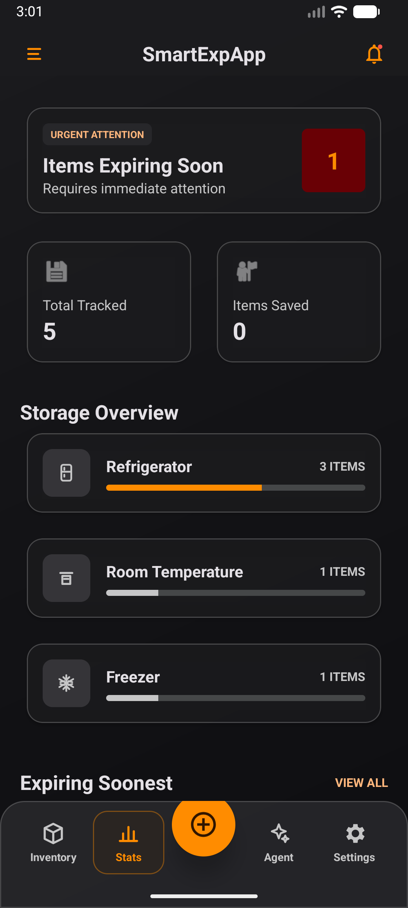
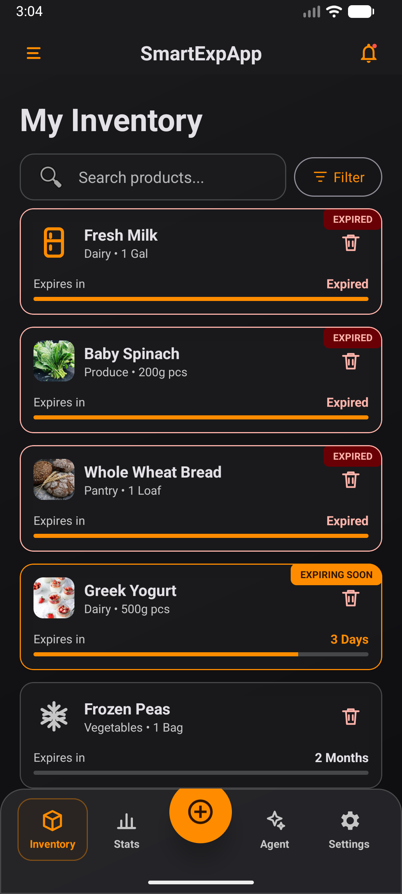
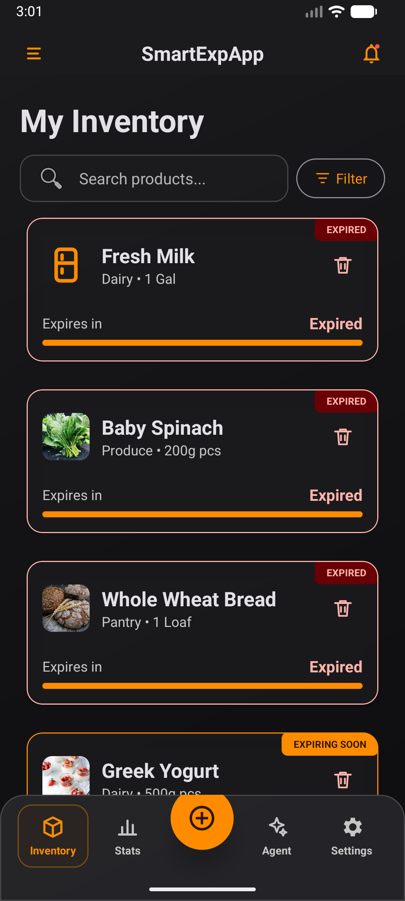
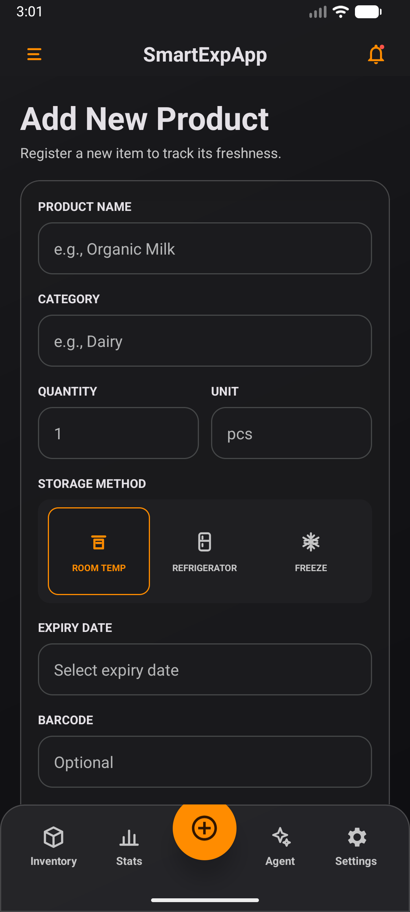
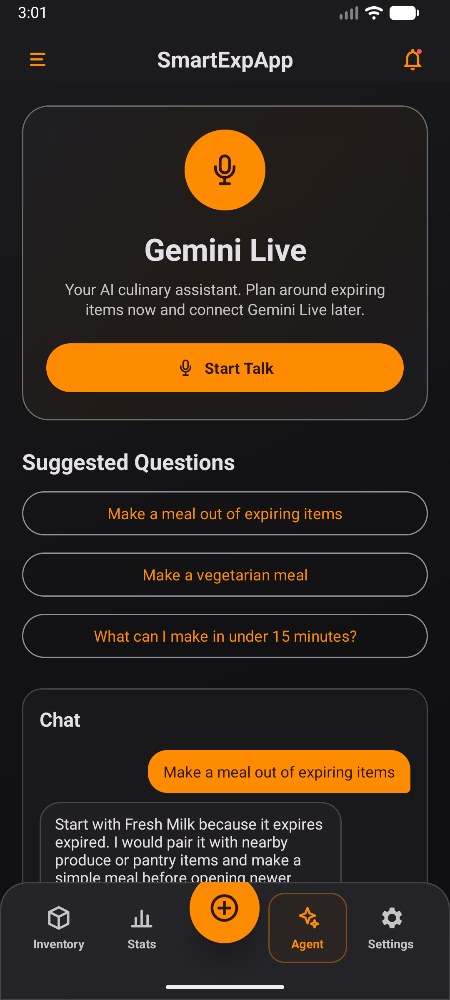
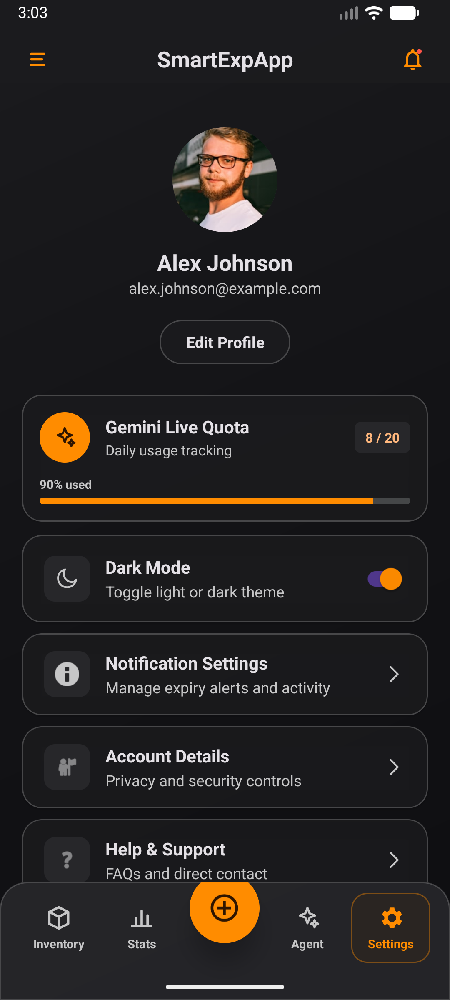
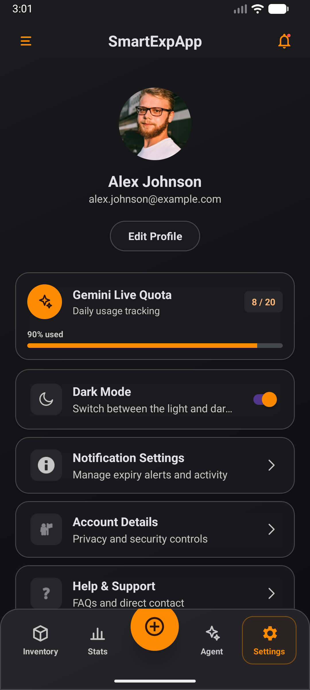
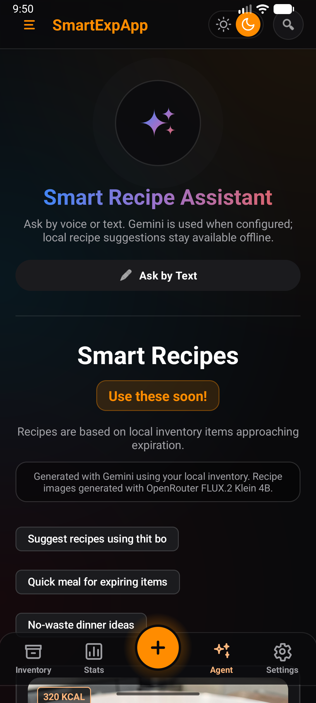
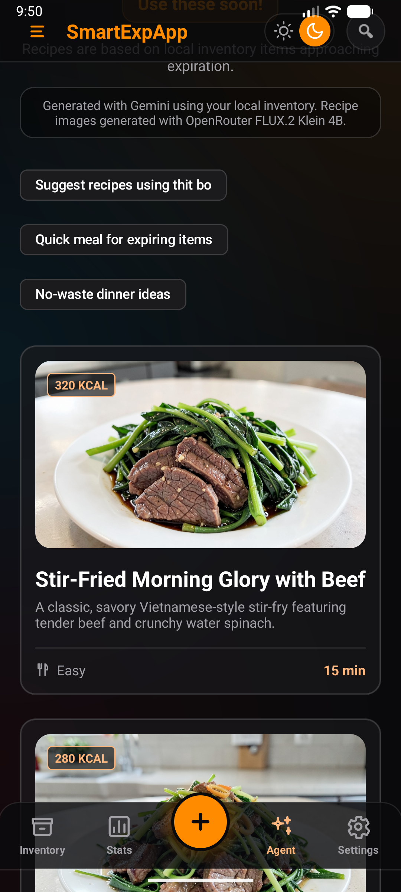

# 📱 SmartExpApp

SmartExpApp is a modern, **local-first Android application** designed to help users track food inventory, manage expiry dates, configure custom reminders, and minimize food waste. Utilizing **Room Database** for seamless offline capability, **ML Kit Text Recognition** for OCR-assisted data entry, and optional **Cloudflare Workers AI** for smart recipe suggestions and natural language parsing, SmartExpApp offers a premium, high-performance food tracking experience.

---

## 🚀 Quick Download

Get the latest build of SmartExpApp immediately. Click below to download the pre-compiled Release APK file:

[](app/build/outputs/apk/release/app-release.apk)

*   **File Path in Repo:** [`app/build/outputs/apk/release/app-release.apk`](file:///c:/Users/ADMIN/AndroidStudioProjects/SmartExpApp/app/build/outputs/apk/release/app-release.apk)
*   **File Size:** ~68 MB
*   **Requirements:** Android 8.0 (API level 28) or higher.

> [!NOTE]
> If you built the project from source, you can find the generated APK in the path listed above. If signing credentials are not configured, Gradle compiles `app-release-unsigned.apk` instead.

---

## 🌟 Core Features

-   🗃️ **Local-First Storage:** Fully functional offline database powered by Android Room DB with instant responsiveness.
-   🔮 **Smart Add Parsing:** Batch add multiple products in natural language via voice or text input, parsed dynamically.
-   👁️ **OCR Expiry Scanner:** Leverage Google ML Kit Text Recognition to extract expiry dates directly from food label images.
-   🍳 **AI Recipe Suggestions:** Generate culinary ideas based on ingredients currently in your inventory, accompanied by AI-generated images.
-   💬 **AI Assistant (Chat Agent):** Built-in smart chef chatbot for cooking questions and ingredient substitutions.
-   🔄 **Firebase Cloud Sync:** Optional secure cloud synchronization for multi-device login using Firebase Authentication and Firestore.
-   🌓 **Seamless Dark Mode:** Dynamic, harmonized light/dark mode styling throughout the entire application.

---

## 📸 Visual Tour

### Side-by-Side Screen Showcase

| Feature / Screen | Light Mode | Dark Mode |
| :--- | :---: | :---: |
| **Dashboard** <br> View inventory health metrics, item statistics, consumption history, and categories. |  |  |
| **Inventory & Expirations** <br> Scan items, manage expiration alerts (expired, soon, active), filter, search, and sort. |  |  |
| **Smart Add Parsing** <br> Add products using structured text/voice input with instantaneous AI parsing. |  |  |
| **AI Assistant Chat** <br> Chat with your virtual smart kitchen assistant for recipes and inventory tips. |  |  |
| **System Settings** <br> Set custom warning thresholds (e.g., alert 3 days before expiry) and manage databases. |  |  |

### Specialized Features

| AI Recipes Generator | Interactive Recipe Cards | Authentication Screen |
| :---: | :---: | :---: |
|  <br> Choose ingredients to cook |  <br> AI Culinary suggestions |  <br> Optional Cloud Account Login |

---

## 🛠️ Architecture & Tech Stack

```mermaid
graph TD
    UI[Android UI / Activities] --> VM[ViewModels]
    VM --> Repo[Repositories]
    Repo --> Room[Room Database (Local Cache)]
    Repo --> Sync[Firestore Sync Manager]
    Repo --> CF[Cloudflare Workers AI]
    CF --> CF1[Recipe Image Generator]
    CF --> CF2[Natural Language Parser]
    CF --> CF3[Llama-3 Chat Assistant]
    Sync --> FB[Firebase Firestore]
```

-   **Frontend:** Native Android (Java / Android SDK API 36)
-   **Database:** Room Database (local SQLite), Firebase Firestore (optional cloud sync)
-   **Authentication:** Firebase Auth & Android Credential Manager (One-Tap Sign-in)
-   **AI Services:** Cloudflare Workers AI endpoints (Llama, product parser, and recipe images)
-   **OCR Engine:** Google ML Kit Text Recognition

---

## ⚙️ Setup & Installation

### Local Build Requirements
-   Android Studio (Ladybug or newer recommended)
-   JDK 11
-   An Android emulator or physical device running Android 8.0+

### Configuration
1.  Open the project root in Android Studio.
2.  A real `app/google-services.json` is optional for local/demo work (if missing, a placeholder is auto-generated by the build script so compile completes).
3.  Configure AI Workers by adding the following endpoints in `local.properties` (located in the root directory) or environment variables:

```properties
AI_WORKER_URL=https://your-worker.example.workers.dev
RECIPE_IMAGE_WORKER_URL=https://your-worker.example.workers.dev
PRODUCT_PARSER_WORKER_URL=https://your-worker.example.workers.dev
```

*Note: SmartExpApp has native local fallback behaviors when worker URLs are blank, ensuring all offline capabilities continue to work gracefully.*

---

## 🧪 Verification & Testing

To run unit and local integration tests, run the following commands in PowerShell:

```powershell
# Run local Room and Repository unit tests
.\gradlew.bat test

# Assemble debug build
.\gradlew.bat :app:assembleDebug

# Run Lint checks
.\gradlew.bat :app:lintDebug

# Test Firestore security rules
npm run test:firestore-rules
```

If you have a physical device or emulator running:
```powershell
# Run Android Instrumentation tests
.\gradlew.bat connectedDebugAndroidTest
```

---

## 📦 Building a Release APK

To package a signed release APK, create a file named `release-signing.properties` in the project root:

```properties
STORE_FILE=C:\\path\\to\\smartexp-release.jks
STORE_PASSWORD=your_keystore_password
KEY_ALIAS=your_key_alias
KEY_PASSWORD=your_key_password
```

*(Alternatively, define environment variables: `SMARTEXP_RELEASE_STORE_FILE`, `SMARTEXP_RELEASE_STORE_PASSWORD`, `SMARTEXP_RELEASE_KEY_ALIAS`, and `SMARTEXP_RELEASE_KEY_PASSWORD`.)*

Then execute:
```powershell
.\gradlew.bat :app:assembleRelease
```
The resulting package will be stored under: `app/build/outputs/apk/release/app-release.apk`.

---

## 📋 Evaluation Demo Flow

Here is a recommended path to test the application's functionality:

1.  **Guest Session:** Launch as guest or local-only user (no credentials required).
2.  **Product Insertion:** Add a food item manually, validating quantity and positive numeric boundaries.
3.  **Storage Assignment:** Switch the storage category between `Room Temp`, `Refrigerator`, and `Freezer`.
4.  **OCR Scan:** Tap the camera icon, upload an image of a food label, and verify it successfully extracts an expiration date.
5.  **Smart Add:** Try voice/text natural language parsing (e.g., *"Add 3 apples expiring next week and 2 cartons of milk"*).
6.  **Inventory Controls:** Filter by category, sort by expiration, and mark items as consumed, wasted, or donated (supports undo action).
7.  **Data Analytics:** Open the stats dashboard and toggle date ranges to view wastage trends.
8.  **Reminders:** Adjust the days-before warning threshold in notification settings.
9.  **Data Export:** Export room database tables to JSON files and test the local data deletion.
10. **AI Integration:** Test AI recipes and chatbot response fallbacks.

---

## ⚠️ Limitations & Notes
-   Cloudflare AI Features are optional; the application automatically falls back to static generation if worker endpoints are not set up.
-   Firestore synchronization requires a valid `google-services.json` and a user to be actively signed in.
-   This application is compiled as a school evaluation/project target and is not configured for direct Google Play Store release.
