# Tài liệu thiết kế — SmartExpApp

> Ứng dụng Android quản lý thực phẩm & hạn sử dụng, **local-first** (Room DB), có
> OCR (ML Kit), Smart Add bằng ngôn ngữ tự nhiên, gợi ý công thức bằng AI
> (Cloudflare Workers), nhắc nhở (WorkManager) và đồng bộ đám mây tùy chọn
> (Firebase Auth + Firestore).
>
> Tất cả sơ đồ dùng cú pháp **Mermaid** nên xem trực tiếp được trên GitHub.

## Mục lục
1. [Tổng quan & phạm vi](#1-tổng-quan--phạm-vi)
2. [Kiến trúc hệ thống](#2-kiến-trúc-hệ-thống)
3. [Thiết kế cơ sở dữ liệu (ERD)](#3-thiết-kế-cơ-sở-dữ-liệu-erd)
4. [Sơ đồ luồng dữ liệu (DFD)](#4-sơ-đồ-luồng-dữ-liệu-dfd)
5. [Sequence Diagram](#5-sequence-diagram)
6. [Activity Diagram](#6-activity-diagram)
7. [Mô tả giải thuật (mã giả)](#7-mô-tả-giải-thuật-mã-giả)
8. [Thiết kế màn hình & điều hướng](#8-thiết-kế-màn-hình--điều-hướng)
9. [Phụ lục: bản đồ mã nguồn](#9-phụ-lục-bản-đồ-mã-nguồn)

---

## 1. Tổng quan & phạm vi

| Hạng mục | Nội dung |
|---|---|
| Nền tảng | Android (minSdk 28 / targetSdk 36), Java |
| Kiến trúc | MVVM + Repository, offline-first |
| Lưu trữ cục bộ | Room Database (8 bảng, schema v8) |
| Đồng bộ đám mây | Firebase Auth (Google) + Cloud Firestore (tùy chọn) |
| AI | Cloudflare Workers AI (parse Smart Add, gợi ý công thức + ảnh) — có **fallback cục bộ** |
| OCR | Google ML Kit Text Recognition (quét ngày trên nhãn) |
| Tác vụ nền | WorkManager (nhắc nhở hết hạn định kỳ) |
| Ngôn ngữ | Tiếng Anh + Tiếng Việt (đổi trong app) |
| Giao diện | Sáng/Tối, thiết kế "glass", edge-to-edge |

**Tác nhân (actor):** Người dùng (khách hoặc đã đăng nhập). Hệ thống ngoài:
Firebase, Cloudflare Worker, ML Kit, hệ thống thông báo Android.

---

## 2. Kiến trúc hệ thống

### 2.1 Sơ đồ kiến trúc phân tầng

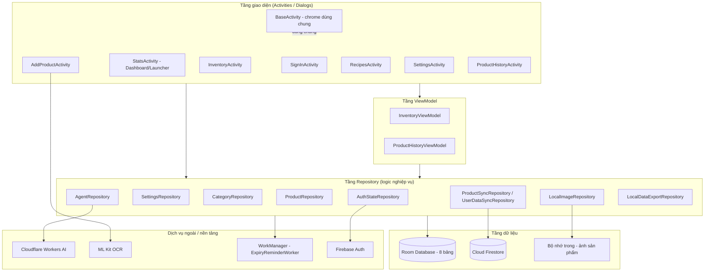

### 2.2 Vai trò các tầng

- **UI (Activities):** hiển thị, nhận thao tác. `BaseActivity` cung cấp phần khung
  dùng chung (top bar, bottom nav, đổi theme/ngôn ngữ, xử lý inset status bar,
  bộ chọn ảnh camera/thư viện).
- **ViewModel:** giữ trạng thái màn hình, expose `LiveData`, sống qua xoay màn
  hình / đổi theme (config change) → không mất dữ liệu.
- **Repository:** điểm truy cập dữ liệu duy nhất; điều phối Room ↔ Firestore ↔
  Cloudflare; chạy I/O trên thread nền rồi trả callback về main thread.
- **Data:** Room là nguồn chân lý cục bộ; Firestore là bản sao đám mây; ảnh lưu
  trong bộ nhớ trong app.
- **External:** OCR, AI, lập lịch nền, xác thực — đều có đường lui (fallback) để
  app vẫn dùng được offline.

### 2.3 Nguyên tắc thiết kế chính
1. **Offline-first:** mọi thao tác ghi vào Room trước; đồng bộ/AI là bổ trợ.
2. **Graceful degradation:** không mạng / không worker → parse & gợi ý cục bộ.
3. **Single source of truth:** UI quan sát Room qua Repository/ViewModel.
4. **Tách biệt nền/giao diện:** I/O ở thread nền, cập nhật UI ở main thread.

---

## 3. Thiết kế cơ sở dữ liệu (ERD)

### 3.1 Sơ đồ thực thể — quan hệ

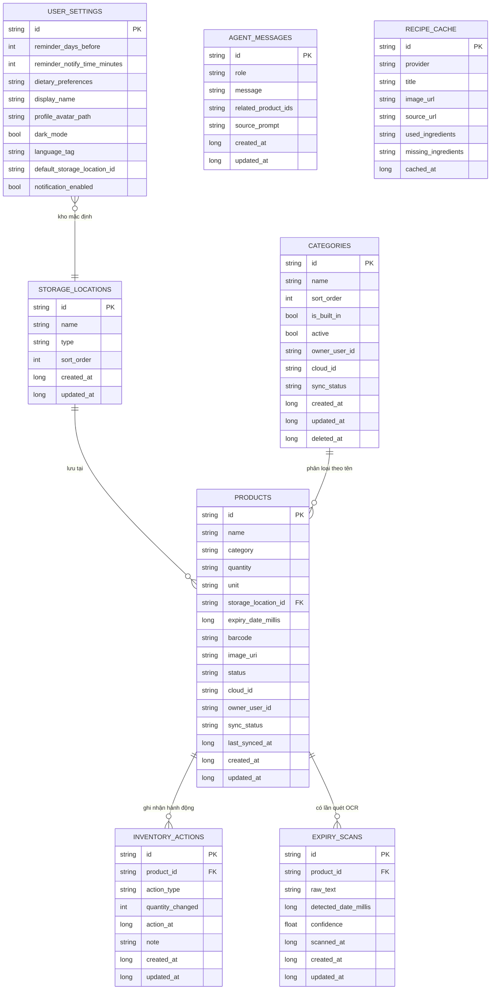

### 3.2 Mô tả bảng chính

- **products** — sản phẩm trong kho. `status` ∈ {ACTIVE, CONSUMED, WASTED,
  DONATED, EXPIRED, DELETED}. Có khóa ngoại tới `storage_locations`, index theo
  `storage_location_id`, `expiry_date_millis`, `barcode`. Các cột `cloud_id`,
  `owner_user_id`, `sync_status`, `last_synced_at` phục vụ đồng bộ Firestore.
- **storage_locations** — kho bảo quản (Nhiệt độ phòng / Tủ lạnh / Ngăn đông),
  id chuẩn hóa: `room_temp`, `refrigerator`, `freeze`.
- **categories** — danh mục; unique theo `(owner_user_id, name)`; phân biệt
  danh mục mặc định (`is_built_in`) và do người dùng tạo; hỗ trợ xóa mềm
  (`deleted_at`).
- **inventory_actions** — nhật ký vòng đời (đã dùng/bỏ/tặng…) để dựng màn Lịch sử
  và thống kê Dashboard. FK tới `products`.
- **expiry_scans** — kết quả OCR thô + ngày phát hiện + độ tin cậy.
- **agent_messages** — lịch sử hội thoại trợ lý AI.
- **recipe_cache** — cache công thức (Cloudflare hoặc cục bộ) để dùng offline.
- **user_settings** — bảng **singleton** (`id = 'default'`): nhắc nhở, theme,
  ngôn ngữ, kho mặc định, hồ sơ.

### 3.3 Cấu trúc đồng bộ Firestore (tùy chọn)

```
users/{uid}
  ├── products/{productId}      ← bản sao của products (owner_user_id = uid)
  └── categories/{categoryId}   ← bản sao của categories
```
Cờ `sync_status` trên bản ghi cục bộ điều khiển việc đẩy/kéo; ghi cục bộ luôn
diễn ra trước, đồng bộ diễn ra nền.

---

## 4. Sơ đồ luồng dữ liệu (DFD)

### 4.1 DFD mức ngữ cảnh (Level 0)

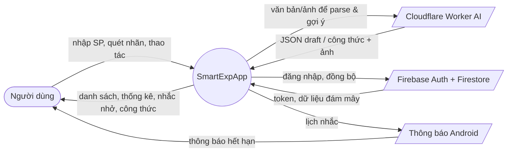

### 4.2 DFD mức 1 (các tiến trình chính)

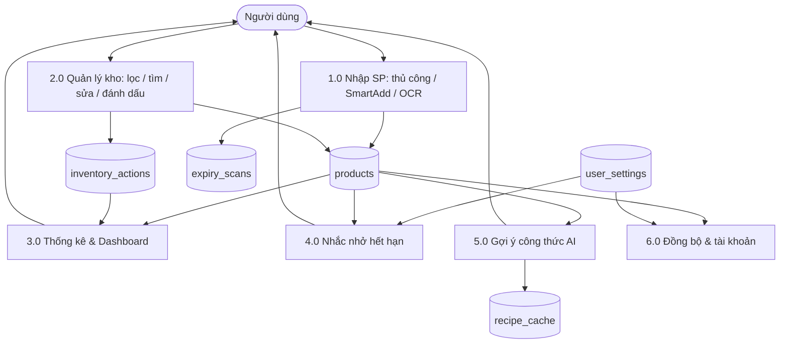

---

## 5. Sequence Diagram

### 5.1 Thêm sản phẩm bằng OCR quét nhãn

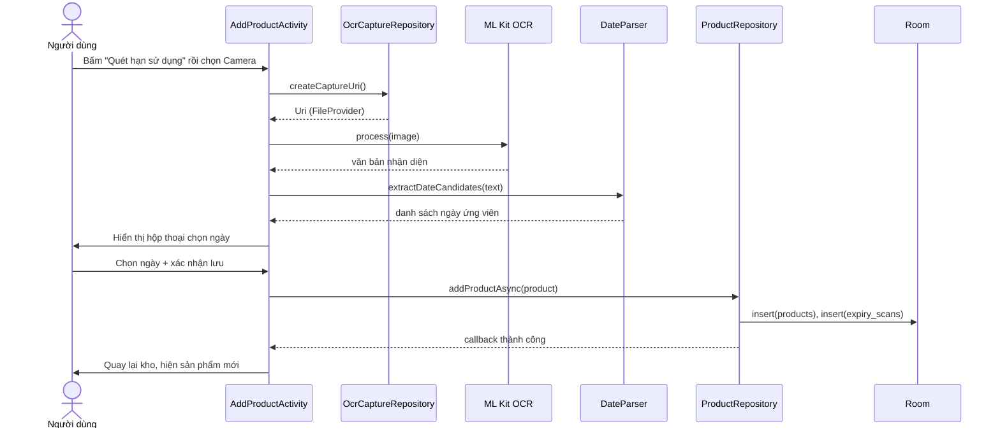

### 5.2 Smart Add (ngôn ngữ tự nhiên)

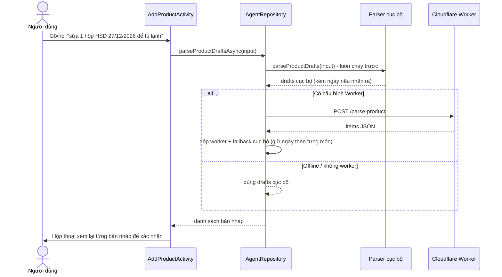

### 5.3 Nhắc nhở hết hạn (WorkManager)

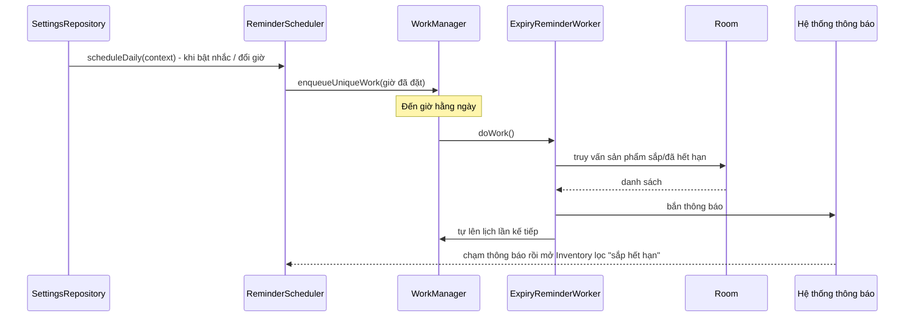

### 5.4 Đồng bộ đám mây

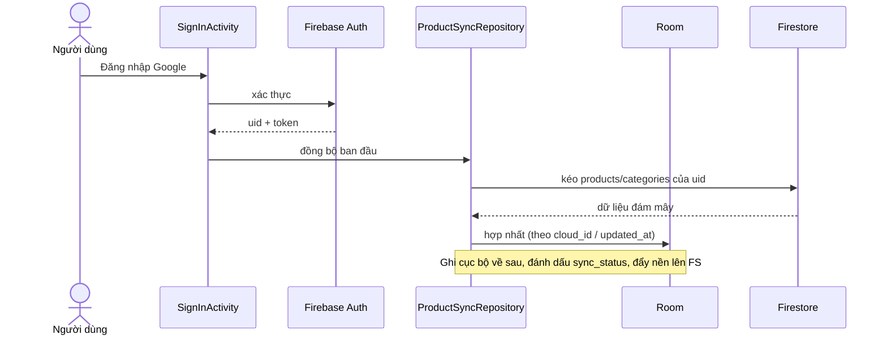

### 5.5 Gợi ý công thức AI (kèm fallback)

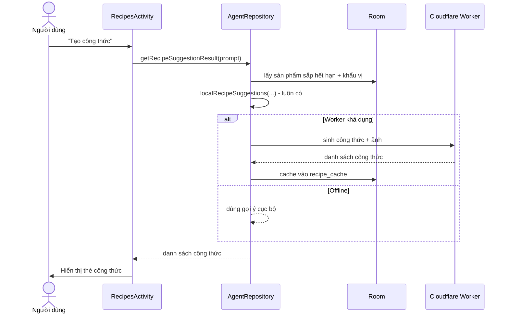

---

## 6. Activity Diagram

### 6.1 Luồng khởi động & xác thực

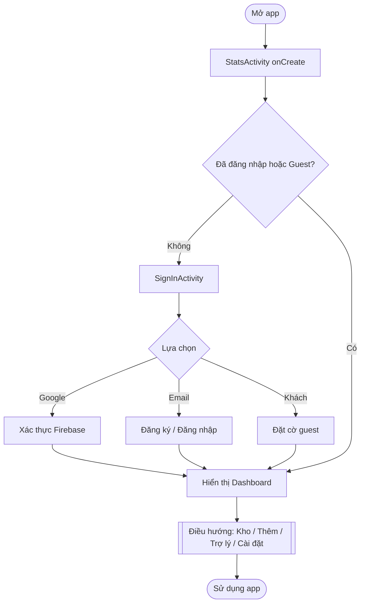

### 6.2 Vòng đời sản phẩm

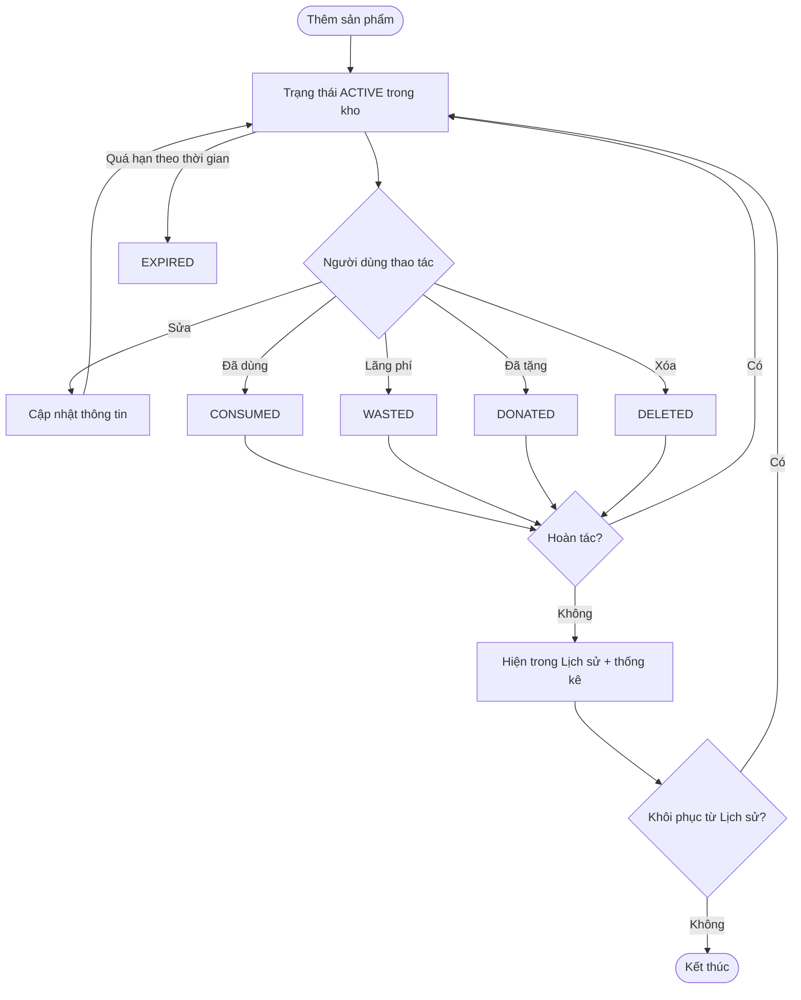

---

## 7. Mô tả giải thuật (mã giả)

### 7.1 Trích xuất ngày từ văn bản OCR/Smart Add (`DateParser`)

```text
HÀM extractDateCandidates(text) -> danh sách (ngày, độ_tin_cậy):
    ứng_viên   ← []
    đã_thấy    ← tập rỗng (theo millis, để khử trùng lặp)

    # Bước 1: ngày CÓ dấu phân cách (dd/MM/yyyy, yyyy-MM-dd, "dd MMM yyyy"...)
    VỚI MỖI m TRONG so_khớp(text, MẪU_NGÀY_CÓ_PHÂN_CÁCH):
        VỚI MỖI fmt TRONG DANH_SÁCH_ĐỊNH_DẠNG:
            thử parse(m, fmt) với lenient = false
            NẾU parse thành công VÀ 2000 <= năm < 2100:
                nếu millis chưa có trong đã_thấy thì thêm ứng_viên
                DỪNG (lấy định dạng khớp đầu tiên)

    # Bước 2: ngày GỌN không phân cách (vd 290527, 20261227) - thường gặp trên nhãn
    VỚI MỖI m TRONG so_khớp(text, "\b(\d{8}|\d{6})\b"):
        formats ← (8 chữ số ? [ddMMyyyy, yyyyMMdd, MMddyyyy]
                              : [ddMMyy,   yyMMdd,   MMddyy])
        VỚI MỖI fmt TRONG formats:
            thử parse(m, fmt) với lenient = false
            NẾU hợp lệ VÀ 2000 <= năm < 2100:
                thêm MỌI cách hiểu hợp lệ làm ứng viên riêng
                # KHÔNG dừng: ngày gọn nhập nhằng -> để người dùng chọn

    sắp xếp ứng_viên theo thời gian tăng dần
    TRẢ VỀ ứng_viên
```
> Ranh giới từ `\b` đảm bảo không khớp nhầm bên trong số dài (barcode/lot).
> Ví dụ: `290527` -> {29/05/2027, 27/05/2029} (người dùng chọn trong hộp thoại OCR).

### 7.2 Suy ra hạn dùng từ ngôn ngữ tự nhiên (`inferExpiryMillis`)

```text
HÀM inferExpiryMillis(source) -> millis | null:
    NẾU source chứa "ngày mai" / "tomorrow"  -> TRẢ cuối_ngày(hôm nay + 1)
    NẾU source chứa "hôm nay" / "today"       -> TRẢ cuối_ngày(hôm nay)
    NẾU khớp "in/after N days"                -> TRẢ cuối_ngày(hôm nay + N)
    ds ← DateParser.extractDates(source)
    NẾU ds không rỗng                         -> TRẢ cuối_ngày(ds[0])
    TRẢ null     # thận trọng: không tự "bịa" ngày
```

### 7.3 Phân loại trạng thái hết hạn cho Dashboard

```text
HÀM phân_nhóm(sản_phẩm, ngưỡng_khẩn, ngưỡng_sắp_hết):
    NẾU sản_phẩm.status != ACTIVE  -> bỏ qua (đã xử lý)
    days ← số_ngày_đến_hạn(sản_phẩm)        # âm nếu đã quá hạn
    NẾU days < 0                   -> "Hết hạn"
    NGƯỢC LẠI NẾU days <= ngưỡng_khẩn     -> "Khẩn cấp"
    NGƯỢC LẠI NẾU days <= ngưỡng_sắp_hết  -> "Sắp tới"
    NGƯỢC LẠI                              -> "An toàn"
```

### 7.4 Lập lịch nhắc nhở (`ReminderScheduler`)

```text
HÀM scheduleDaily(context):
    phút ← user_settings.reminder_notify_time_minutes   # mặc định 540 = 09:00
    trễ  ← thời_gian_đến_lần_kế(phút, bây_giờ)
    enqueueUniqueWork(WORK_DAILY, KEEP/REPLACE,
                      OneTimeWork(ExpiryReminderWorker, initialDelay = trễ))

# Trong ExpiryReminderWorker.doWork():
    items ← truy vấn sản phẩm ACTIVE có days <= reminder_days_before
    NẾU items không rỗng -> bắn thông báo (mở Inventory lọc "sắp hết hạn")
    scheduleDaily(context)        # tự đặt lịch cho ngày kế tiếp
```

---

## 8. Thiết kế màn hình & điều hướng

### 8.1 Sơ đồ điều hướng

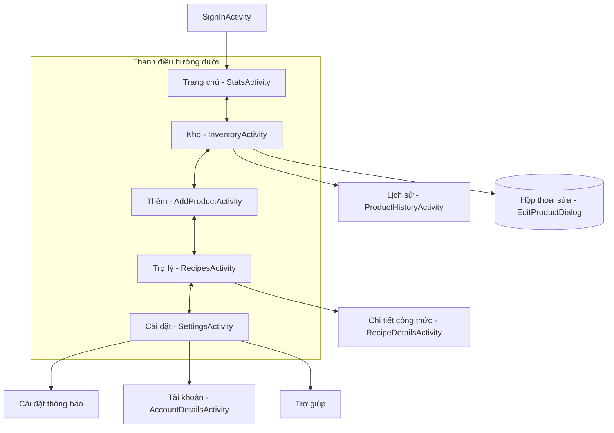

### 8.2 Wireframe các màn hình chính

**Trang chủ / Dashboard**
```
┌─────────────────────────────┐
│ SmartExpApp        sun moon  │  ← top bar + đổi theme
├─────────────────────────────┤
│ ! CẦN CHÚ Ý                  │
│ Sắp hết hạn            [ 3 ] │
├─────────────────────────────┤
│ [ Tuần ][ Tháng ][ Tất cả ] │  ← khoảng thống kê
│ ┌────────┐ ┌────────┐        │
│ │Đã dùng │ │Đã tặng │ ...    │  ← thẻ số liệu
│ └────────┘ └────────┘        │
│ Xu hướng chống lãng phí ▭▭   │
│ Tổng quan kho ▭▭▭            │
│ • Hết hạn / Khẩn cấp / ...   │  ← nhóm SP (chấm màu danh mục)
├─────────────────────────────┤
│ Home  Kho  (+)  Trợ lý  CĐ   │  ← bottom nav
└─────────────────────────────┘
```

**Kho (Inventory)**
```
┌─────────────────────────────┐
│ SmartExpApp   archive sun/mn │
│ [ tìm sản phẩm... ]          │
│ ┌─ Bộ lọc (glass panel) ───┐ │
│ │ Hạn dùng      [ Tất cả ▾]│ │
│ │ Kiểu bảo quản [ Tất cả ▾]│ │
│ │ Sắp xếp       [Cũ nhất ▾]│ │
│ └──────────────────────────┘ │
│ ┌──────────────────────────┐ │
│ │● Tên SP             ✕    │ │  ← chạm: sửa/đánh dấu/xóa
│ │  Kho - Số lượng          │ │     nhấn giữ: chọn nhiều
│ │  Hết hạn sau:   N tháng  │ │
│ └──────────────────────────┘ │
│ Home  Kho  (+)  Trợ lý  CĐ   │
└─────────────────────────────┘
```

**Thêm sản phẩm (Add Product)**
```
┌─────────────────────────────┐
│ Thêm sản phẩm                │
│ ┌─ Smart Add (AI) ─────────┐ │
│ │ [Nói]      [Gõ]          │ │
│ └──────────────────────────┘ │
│ TÊN SP        [___________]  │
│ SỐ LƯỢNG [__]  ĐƠN VỊ [__▾]  │
│ DANH MỤC  [_____] [Quản lý]  │
│ KHO  (Phòng)(Tủ lạnh)(Đông)  │
│ HẠN DÙNG    [ 09/12/2029 📅] │  ← dd/MM/yyyy
│ ẢNH      [Chụp ảnh / Thư viện]│
│ [   Quét hạn sử dụng (OCR)  ]│
│ [        Thêm sản phẩm      ]│
└─────────────────────────────┘
```

**Trợ lý / Công thức (Recipes)**
```
┌─────────────────────────────┐
│ Trợ lý công thức thông minh  │
│ Hỏi bằng giọng nói / văn bản │
│ [    Hỏi bằng văn bản      ] │
│ [    Tạo công thức         ] │
│ ┌── Thẻ công thức ────────┐  │
│ │ Tên món                 │  │  → Chi tiết công thức
│ │ nguyên liệu / calo      │  │
│ └─────────────────────────┘  │
│ Home  Kho  (+)  Trợ lý  CĐ   │
└─────────────────────────────┘
```

**Cài đặt (Settings)**
```
┌─────────────────────────────┐
│ Hồ sơ: Tên / Email           │
│ Nhắc nhở: Bật · 09:00      ⏵ │ → Cài đặt thông báo
│ KHO & THỰC PHẨM              │
│  • Tùy chọn bảo quản       ⏵ │ → dialog (Phòng/Tủ lạnh/Ngăn đông)
│  • Tùy chọn ăn uống        ⏵ │
│ ỨNG DỤNG                     │
│  • Ngôn ngữ (Việt/Anh)     ⏵ │
│  • Chế độ tối          [☐/☑] │
│ TÀI KHOẢN                    │
│  • Hồ sơ / Xuất / Xóa dữ liệu│ → AccountDetailsActivity
└─────────────────────────────┘
```

> Tất cả màn hình dùng nền gradient "glass" đồng nhất (sáng & tối), top bar không
> đè status bar, và giữ vị trí cuộn khi đổi theme / ngôn ngữ.

---

## 9. Phụ lục: bản đồ mã nguồn

| Thành phần | Vị trí |
|---|---|
| Activities / Dialog | `app/src/main/java/com/example/smartexpapp/*.java` |
| ViewModels | `InventoryViewModel.java`, `ProductHistoryViewModel.java` |
| Repository | `data/*Repository.java` |
| Đồng bộ Firestore | `data/firestore/*.java` |
| Room (Entity/DAO/DB) | `data/local/*Entity.java`, `*Dao.java`, `AppDatabase.java` |
| Schema đã export | `app/schemas/.../3..8.json` |
| Giải thuật ngày | `util/DateParser.java`, `AgentRepository.inferExpiryMillis` |
| Nhắc nhở | `notifications/ReminderScheduler.java`, `ExpiryReminderWorker.java` |
| Mô hình | `model/Product.java`, `ProductStatus.java`, `ProductDraft.java`, `Recipe.java` |

---

*Tài liệu mô tả thiết kế — kèm theo mã nguồn SmartExpApp. Cập nhật theo schema Room v8.*
