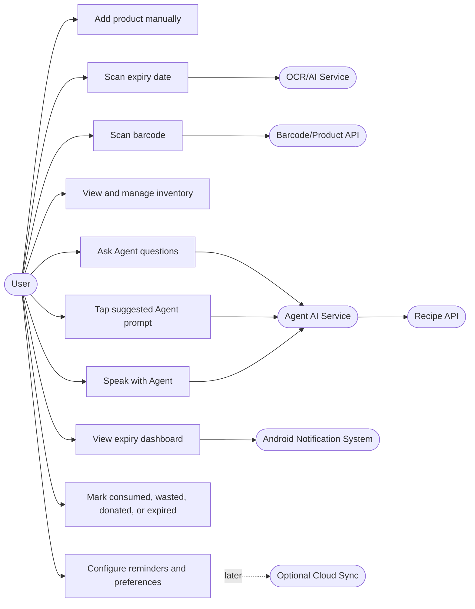
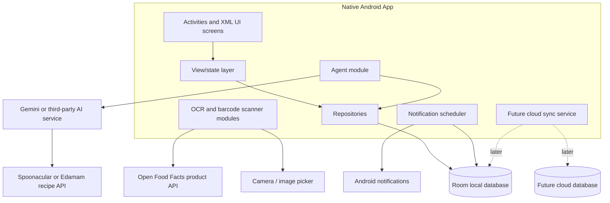
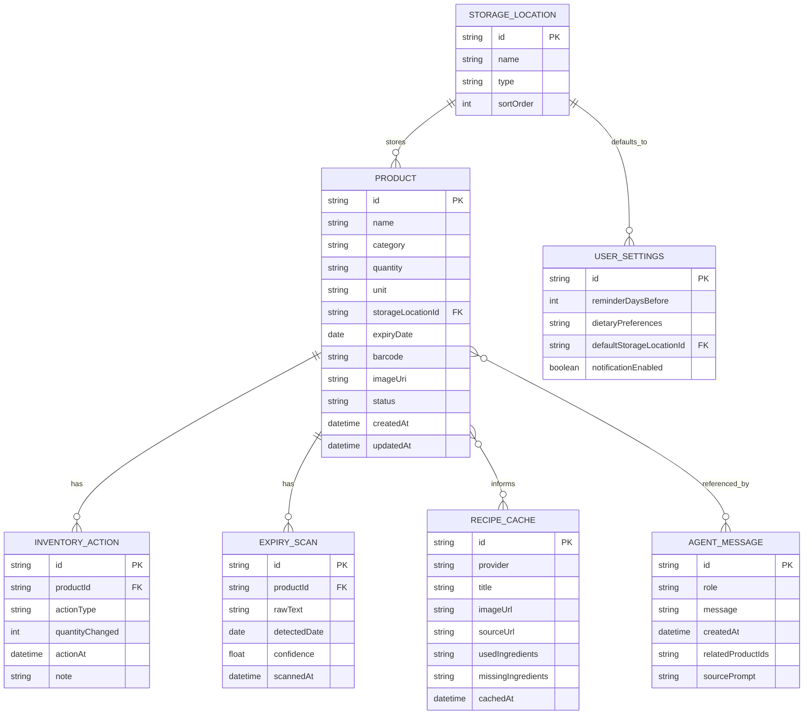
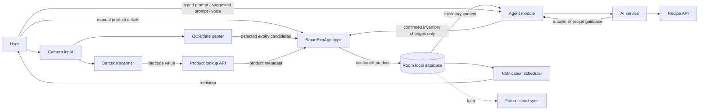
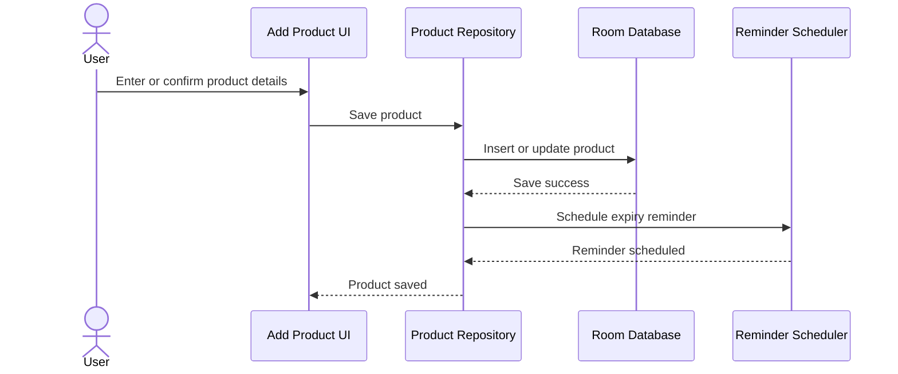
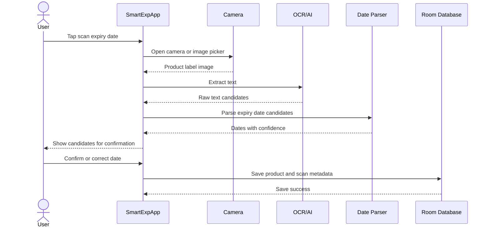
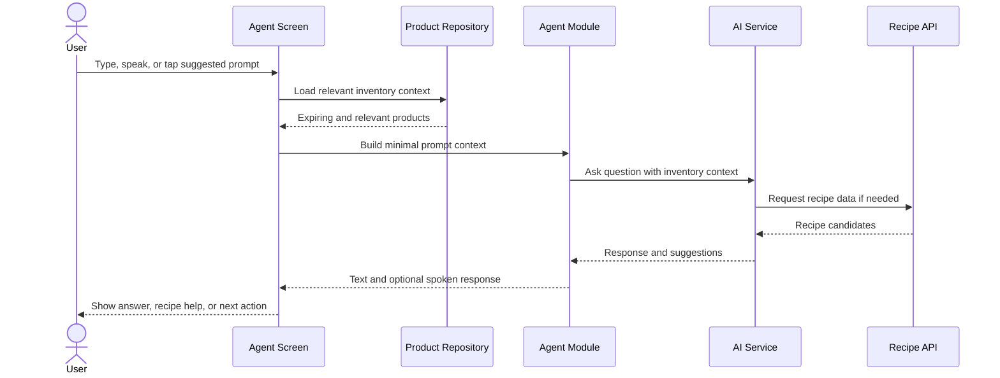
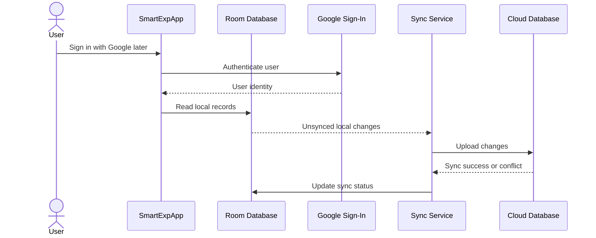

# SmartExpApp General Route

## 1. Product Scope

SmartExpApp is a native Android app that helps users reduce food and product waste by tracking expiry dates, warning users before items expire, and using an AI Agent to answer inventory questions, suggest recipes, and recommend actions for expiring items.

### Primary user goal

Users should be able to add products quickly, know what needs attention today, and ask the Agent what to cook or do before items expire.

### MVP scope

1. Local-first persistent inventory with add, edit, delete, search, filter, and sort.
2. Expiry dashboard with expired, today, soon, and safe product groups.
3. Local reminders before products expire.
4. OCR-assisted expiry date scanning with user confirmation.
5. Barcode lookup to auto-fill product details where possible.
6. AI Agent screen with typed prompts, suggested question chips, voice input/output, and recipe help for expiring products.
7. Basic waste impact stats: saved, wasted, expired, donated, and consumed items.
8. Settings for reminders, dietary preferences, storage defaults, and app preferences.

### Storage direction

The first release is local-first. Product data, settings, scan history, Agent context, and inventory actions should be saved locally using Room. Google sign-in and cloud sync can be added later behind the same repository APIs, after the local database contract is stable.

### Out of scope for first release

1. Cloud sync, login, multi-device accounts, and household sharing.
2. Payment, grocery ordering, or retailer cart checkout.
3. Community recipe sharing.
4. Advanced nutrition coaching or medical diet advice.

### Delivery direction

The native Android app in `app/` is the main delivery target. The React/Vite prototype in `googleaistudio/` remains reference material only unless the team explicitly decides to build a web app later.

### Bottom navigation direction

The current `Meals` concept is replaced by `Agent`. Recipe suggestions still exist, but they live inside the Agent screen instead of being treated as a standalone bottom-nav product area.

## 2. Required Diagrams

### 2.1 Use Case Diagram

### 2.2 Architecture Diagram

### 2.3 ERD / Database Schema

### 2.4 Data Flow Diagram

### 2.5 Local Product Save Sequence

### 2.6 OCR Add Product Sequence

### 2.7 Agent Prompt Sequence

### 2.8 Future Cloud Sync Sequence

## 3. GitHub Issue Backlog

| No. | Issue title | Work area |
| --- | --- | --- |
| 1 | Planning: finalize scope, diagrams, and delivery route | `01-planning-diagrams-scope` |
| 2 | Foundation: lock app architecture and persistent data layer | `02-foundation-persistence` |
| 3 | Inventory: implement CRUD, search, filter, and sort | `03-inventory-crud` |
| 4 | Expiry: dashboard status groups and local reminders | `04-expiry-reminders` |
| 5 | OCR: scan and confirm expiry dates from product labels | `05-ocr-expiry-scan` |
| 6 | Barcode: lookup products and auto-fill metadata | `06-barcode-product-lookup` |
| 7 | Agent: voice/chat assistant with recipe help | `07-agent-assistant` |
| 8 | Insights: stats, waste impact, and settings | `08-stats-settings` |
| 9 | QA and submission: tests, README, report, slides, and demo | `09-testing-docs-submission` |

## 4. Work Route

The active integration branch is `dev`. New work should branch from `dev`, merge back into `dev` after review/testing, then merge the final stable release into the repository default branch.

### Work rules

1. Keep `master` stable.
2. Use `dev` as the integration branch.
3. Use one numbered work area per issue group.
4. Open one pull request per work area into `dev`.
5. Do not mix unrelated features in the same pull request.
6. Update report/screenshots after the matching feature is working.
7. Keep public issue descriptions focused on goals and acceptance criteria, not branch details.

### Recommended merge order

1. `01-planning-diagrams-scope`
2. `02-foundation-persistence`
3. `03-inventory-crud`
4. `04-expiry-reminders`
5. `05-ocr-expiry-scan`
6. `06-barcode-product-lookup`
7. `07-agent-assistant`
8. `08-stats-settings`
9. `09-testing-docs-submission`
